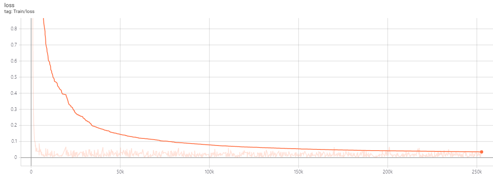

# LegALBERT

### 모델

한국어 ALBERT 경량화 모델

```
embedding size: 128
hidden size: 512
max input length: 512
vocab size: 30100
number of layers: 8
number of attention heads: 8
```

### 학습 데이터

* 한국어 위키
* 국립국어원 말뭉치
  * 구어체 데이터
  * 메신저 데이터
* AI hub
  * 법률 판례 데이터
  * 대화 데이터
* 법률 상담 데이터
* 총 **442M sub words**
  * Huggingface의 BertWordPieceTokenizer 사용

### 학습

Nvidia 2080ti 8장으로 약 9일간 학습


